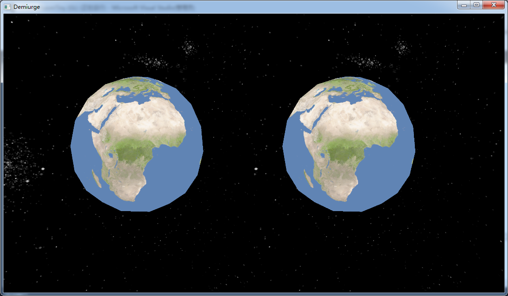

# 过程式纹理
https://www.gamasutra.com/view/feature/131507/a_realtime_procedural_universe_.php

这个网站已经做得非常好了
http://spaceengine.org/universe/

关于过程式内容生成，网站有http://pcg.wikidot.com/pcg-algorithm:universe-generation

Gas Planet 
http://johnwhigham.blogspot.com/2011/11/gas-giants.html

http://johnwhigham.blogspot.com/2012/11/the-birth-of-voxel-planets.html

此外Unity和Unreal都有很多的插件
打算直接选择纹理了
Perlin噪声，非常适用于地形的生成。但是在这里从效率的考虑

关于已有的纹理下载，安利这个网站——
https://www.solarsystemscope.com/textures/

# VR场景搭建

## 选择SDK
https://github.com/ValveSoftware/openvr
Oculus

https://github.com/ValveSoftware/openvr
HTC是用OpenVR开发

后来用的是Oculus……因为Oculus配环境比较麻烦（所以没人借Oculus……）而且Oculus看起来是官网文档比较舒服……

### Oculus SDK 相关文档

https://developer.oculus.com/documentation/pcsdk/latest/concepts/pcsdk-intro/
官方文档

其他的中文资料比较少。所以主要就借助官网文档了。

## 安装
Oculus，反正给我印象非常不好的是安装客户端的速度。
安装非常的慢，大概下了有五六个小时。然后后面的用户登录又被墙了，我都忘了我后面怎么处理的了……反正体验极差。

可以参考一下有类似体验的人（。）
http://www.nofm.cn/blog/read.php/548.htm

不知道自己干了啥反正一番折腾把例子跑起来了，然后就专注于阅读例子了（……）
打算在例程的基础上修改。
其实这个文件全都写在头文件里看起来好难过啊！
于是开始调整代码的结构……
把shader拎出来方便单独调整。

## 天空盒

shader那一块感觉写的有点混乱啊，先强行把天空盒加上吧。

啊……
Oculus例程用的语法是GLSL1.50，但是因为找到的比较靠谱的资料是3.30的，发现兼容性不是非常好……

炸毛炸毛

然后就用原来的立方体，换了个面。
不知道天空盒的纹理是怎么变化的、
天空盒的距离，一个是双眼的时差，一个是人在移动的时候填空盒不能跟随移动。
要除去以前的

不会用samplerCube，相当于手动重新画了。
有很多缺乏完善的地方。一开始想着有很多可以优化的地方，但是到后来被Shader拦住了进度。
然后Oculus内的所有计算用的OVR lib是自家开发的。也就是矩阵运算之类也是需要用它的库。这就又对一些方面造成了麻烦。

## 球面映射
https://blog.csdn.net/t3swing/article/details/79006216

ZX 半径大小
CV 颜色区域

对于GLSL的不熟悉造成所有东西都是写在shader外面的。

附上测试结果的地球.

## perlin噪声
随机纹理

## 界面和天空盒
移去位移。

## 界面和显示 文字

旋转 四元数

~~透明图层绘制顺序~~

交互界面。尝试像的软件一样，在视线的右上方之类的悬浮一个对话框，这样用户可选择。但是尝试之后发现，位于过于角落的对话框很难看清楚，而位于相对较为中间的选择窗口又过于遮挡视线。而且和视线保持同步运动的物体会有一种相对不真实的感觉，所以最后采取的方式和主流的VR游戏一样，采用的是固定位置。

用STB库做的图像读写，但是到文字输出那一块找不到对应的头文件。考虑用SDL库做输出，但是后期转到这里成本也比较高就放弃了……

再也不想做GUI了，计算GUI太麻烦了啦！

避免多次响应

# TODO
感觉还有蛮多需要做的。
我们没有加碰撞、
优化还做的不够
以及模型的精度也还缺乏、

主要 

纹理生成还没做完

LOD

物理仿真

连贯和离散的交互过程

