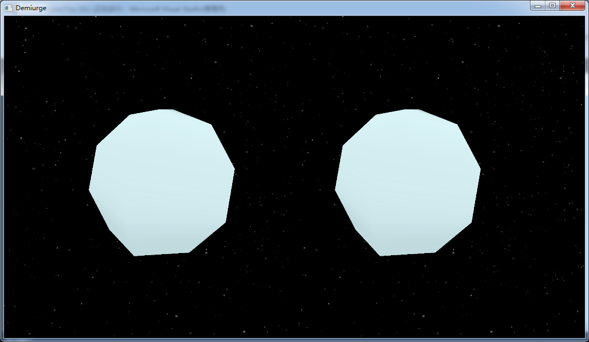
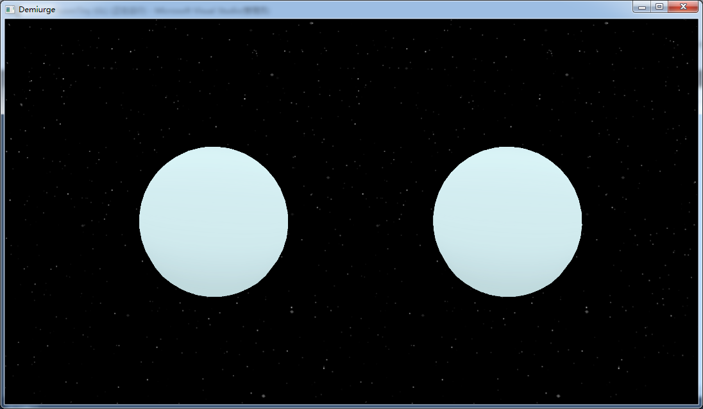
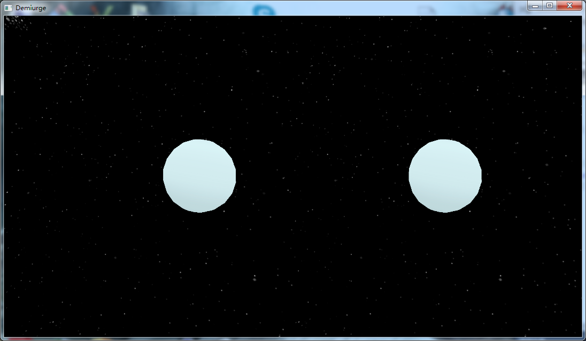
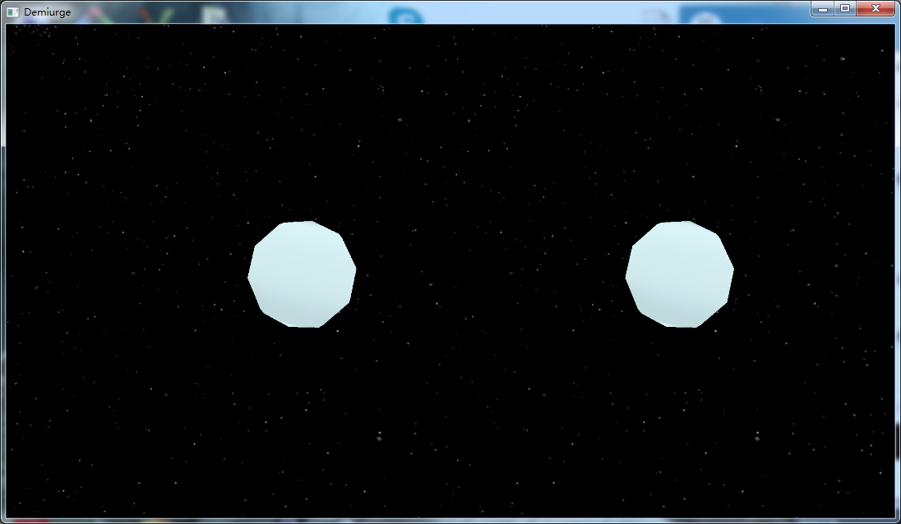
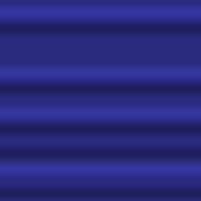
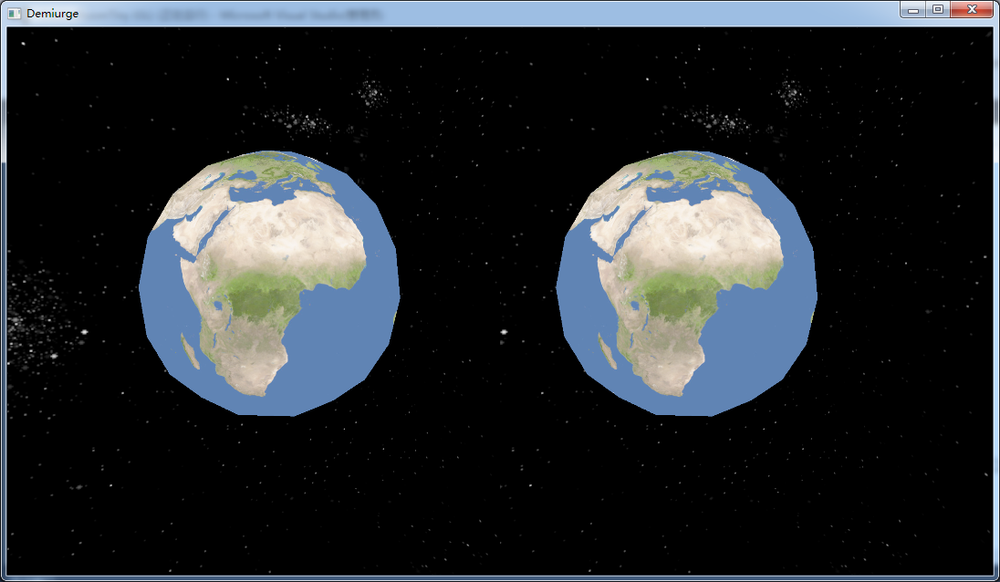
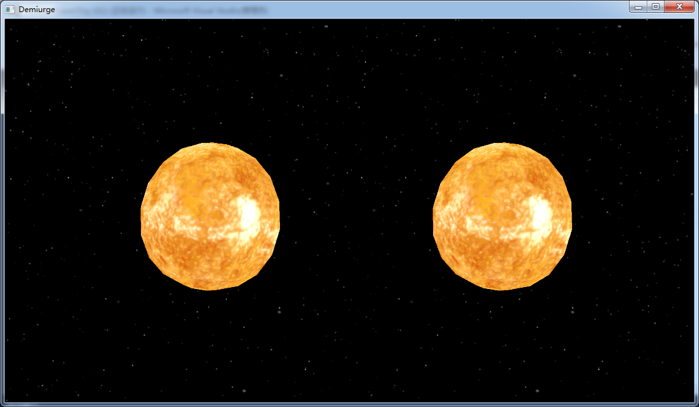
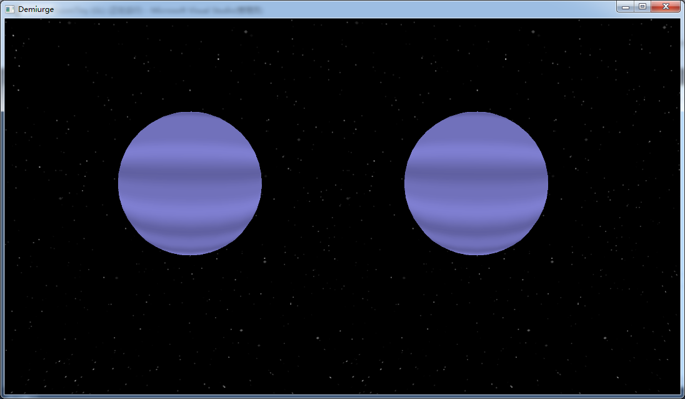
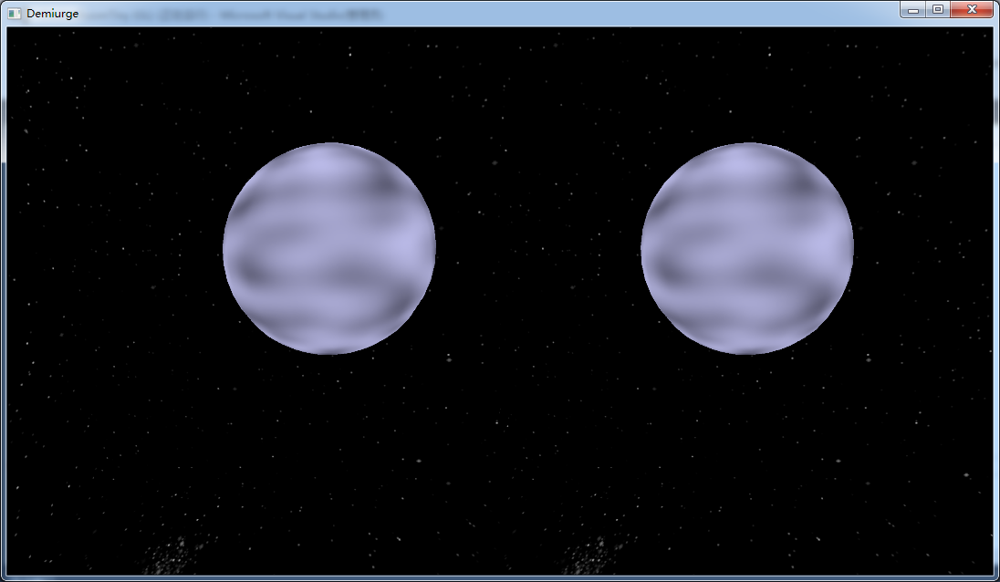

# 虚拟现实与数字娱乐程序报告

 						by 肖鸢，吴萌，方倩如 	

[TOC]

## 游戏介绍

想要用户在这个游戏中体验创世的快感，通过简单的操作创造属于自己的星系。

## 玩法介绍


### 游戏截图


## 开发环境

Oculus PC SDK + Win7

## 具体实现

### 环境配置

一开始在选择配置的时候考虑的一个是Oculus提供的[官方SDK](https://developer.oculus.com/documentation/pcsdk/latest/concepts/pcsdk-intro/),另一个就是基于SteamVR的[OpenVR SDK](https://github.com/ValveSoftware/openvr)。

适当权衡之后，选择了Oculus官方提供的SDK。因为看起来文档相对详细而且排版比较清楚，有比较具体的例程。

当然Oculus官网全程需要翻墙……这一点确实非常的不友好。客户端大概下载了五六个小时，后面用户登录又折腾了蛮久。确实对于国内开发者不太友好。

此外，Oculus有一系列的Unity的中文教程，但是基本上没有PC SDK的中文资料料。整个过程的主要参考是官网文档和官网提供的教程。

### 模型建立

#### 球

我采用对球分段的方式，用四边形（三角面片）去逼近球。

生成球的函数，传入参数是球的中心、球的半径、theta方向上的分段数和phi方向上的分段数。theta和phi的值和坐标的对应关系为：
$$
result =
center + ( cos(\phi)cos(\theta) ,sin(\phi), cos(\phi) sin(\theta)) * radius
$$
在theta和phi分段都为5的时候，能够清楚的看到扭曲的轮廓



这个数值设置为20之后，就能感觉到这是一个非常完整的球。



由于这里没有阴影所以表现效果会差一点orz

#### LOD

因为在这个场景中，球是用三角面片去逼近的，所以一旦球在近处，失真会非常的明显。

所以这里决定做一下离散的LOD。离散的相对实现比较容易。实现的时候，预先存储多个模型，可以直接根据之前到相机的位置以及球的半径确定采用哪个模型。

因为半径在屏幕上决定了三角面片的边的长度，所以取
$$
k = \frac {distance}{radius}
$$
由k的取值，来确定模型的精度。

当然也遇到了离散模型所可能会遇到的突变的问题。
下图是在测试场景中，极小的位移中LOD变化（最后实现的时候对数值做了一定的调整所以不会那么明显）。



#### 相机

 VR游戏中的相机，和常规的3D游戏不同之处在于需要单独确定两个相机的位置。根据玩家左眼和右眼的位置，单独确定左眼和右眼看到的物体，分别渲染。
但是这一步相对比较常规，在例程中提供了左右眼单独渲染以及提供可视化窗口的操作。

此外在具体实现的时候，对于一些特殊物体，比如天空盒和UI，这种位置会跟随玩家的位置变化的物体（但是旋转不会）。这就需要我们操作观察矩阵。需要将光差矩阵移除位移部分但是保留矩阵的旋转部分。

```C++
glm::mat4 view = glm::mat4(glm::mat3(camera.GetViewMatrix()));
```
我们通过取4x4矩阵左上角的3x3矩阵来移除变换矩阵的位移部分。我们可以将观察矩阵转换为3x3矩阵（移除位移），再将其转换回4x4矩阵，来达到类似的效果。 

### 纹理生成及映射

#### 纹理生成

纹理主要采用的是perlin噪声。perlin噪声是一种经典的自然噪声生成算法。

我们给图像赋予一个底色，然后利用噪声的性质，我们使用2D和1D的perlin噪声，分别生成不同的图。

1D的perlin噪声：



2D的perlin噪声：


用户可以通过界面选择分段、颜色、以及选择不同的随机数来生成不同的纹理。

#### 纹理映射

由于之前在生成纹理的时候，通过下述公式
$$
result =
center + ( cos(\phi)cos(\theta) ,sin(\phi), cos(\phi) sin(\theta)) * radius
$$
已经把球上的点和theta和phi对应起来。只需要简单的把theta和phi映射到[0,1]区间内，就可以实现纹理的映射。

我们分别对已有的纹理以及我们生成的纹理进行了测试，映射结果如下：

地球的映射纹理



太阳的映射纹理



1D perlin噪声



2D Perlin噪声



### 交互设计

#### 交互界面

尝试像的软件一样，在视线的右上方之类的悬浮一个对话框，这样用户可选择。但是尝试之后发现，位于过于角落的对话框很难看清楚，而位于相对较为中间的选择窗口又过于遮挡视线。而且和视线保持同步运动的物体会有一种相对不真实的感觉，所以最后采取的方式和主流的VR游戏一样，采用的是固定UI和玩家的相对位置。

此外这里的感受就是，一定不要拿着个头盔直接通过屏幕的输出来判断是否合适。一定要自己戴上头盔去试一试，这样才能知道是不是真的合适。有的时候在屏幕上看感觉大小蛮合理的，但是戴上头盔之后发现这个UI铺天盖地我还得转头才能看清楚整个UI界面。

这里还有遇到的一个问题，我用的是[stb库](https://github.com/nothings/stb)做的图像读写，但是到文字输出那一块发现找不到对应的头文件。考虑用SDL库做输出，但是后期转到这里成本也比较高就放弃了……所以最后看到的文字都是用图像的形式预先计算的。

GUI虽然难度不大，但是计算和设计非常的麻烦。所以CLI才是程序员的美学啊！

#### 手柄事件

我们在设计的时候，决定左手确定用户的移动，右手确定交互和响应。

Oculus Touch手柄如下


左手上方的拨盘决定用户的前进/后退移动。

右手拨盘来调整用户的选择，左右打开下一级目录，上下选择这一级目录的不同内容，最后通过AB按键来调整现在选中目标的数值。在这个过程中，为了避免在一次按键的过程中拨盘的多次响应（因为它主要作用可能不是这样的选择），设置一定的时间响应一次，这样可以避免选中区域疯狂跳动。

### 仿真

#### 运动

用户可以在交互界面上自己定义自转速度和星球的体积，这之后星球会按照预定好的信息自传。

接下来用户可以设定星球到主天体（这个宇宙的中心，类似于太阳对太阳系的概念）的距离以及星球的初始速度。

然后会按照
$$
a = \frac {k}{distance}
$$
的基本公式计算该星球绕主天体运动的轨道。得到的结果基本上会是一个椭圆。


### 音效

音效主要分成两个部分。一个部分是UI相关的音效，这个部分不需要3D的音效。另一个部分是星球碰撞的时候产生的爆炸音效。


## 主要难点


## 不足及改进

感觉最后还有很多欠缺的地方。这部分的欠缺主要原因是经验不足。

### Shader
Shader的问题很多。最后实现的时候我们几乎没有调整已有的shader，所以也就没有实现更加具体效果，比如阴影、光照贴图等种种；而且计算效率相对较低，如果能够熟悉shader的语法的话很多CPU的运算可以转移到GPU当中，这样肯定会提高渲染的效率。

这一部分主要的限制在于Oculus的例程提供的是GLSL1.50，而我之前所接触的是3.30，调整的时候遇到蛮多问题。并且shader的显示比较难，很难知道具体是哪一部分出现的问题。

此外还有原因是，例程的可拓展性较差，而我们的总的结构是参考例程的。如果下一次要写这样的程序，应该会考虑自己重新打整个程序的框架。

### 加速

我在写之前估计，对于星球的物理运动可以和渲染显示分成不同的线程。Oculus官方提供了计算帧率等等的文档以及对于加速的一些建议。但是因为这个项目的话帧率并不是主要的瓶颈，所以没有很注意做这些方面。如果以后开发大型项目的话这确实是需要考虑的一点。I/O和内存分配都还有很大的进步空间。

## 人员分工

肖鸢：程序
负责以上算法的实现。交互设计，报告等。

吴萌：UI设计
交互界面的设计。

方倩如：音乐及手柄接口，音效设计
阅读查询官方文档，确定Oculus手柄和3D音效所需要的API。
确定游戏所采用的音效。

## 个人感想

肖鸢：说来蛮惭愧的，毕竟数字媒体这个专业图形学相关的课程非常的多，但这却是我第一次用可编程管线写的项目。果不其然被shader弄的很狼狈，因为完全没有经验根本无从知道到底是哪一个部分出现了疏忽。再加上我选择从例程入手，这样一方面确实减少了学习Oculus SDK相关的工作量，却也被这份可扩展性较差的代码弄得非常头大。
感觉选择用OpenGL从底层写起，初期确实压力比较大，而且最后实现效果受到各方面的约束，我们必须纯靠代码来实现每个功能，但是个人觉得这是一次不错的尝试。
当然也有很多的不足。我觉得我们这个设置一个架空的宇宙为背景有一定的取巧，因为我衡量自己现有的能力还不足以写出真实感相对较强的VR项目。


## 参考资料

过程式纹理：https://www.gamasutra.com/view/feature/131507/a_realtime_procedural_universe_.php

纹理资源：https://www.solarsystemscope.com/textures/

球面映射：https://blog.csdn.net/t3swing/article/details/79006216

天空盒：https://learnopengl-cn.github.io/04%20Advanced%20OpenGL/06%20Cubemaps/